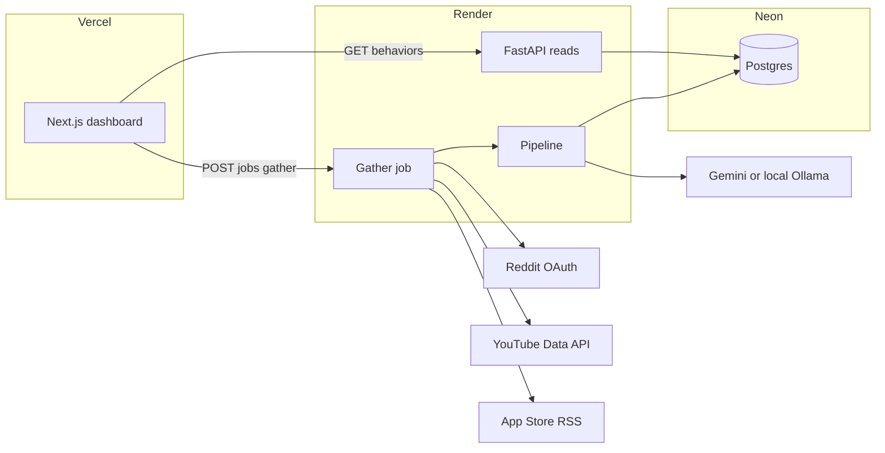
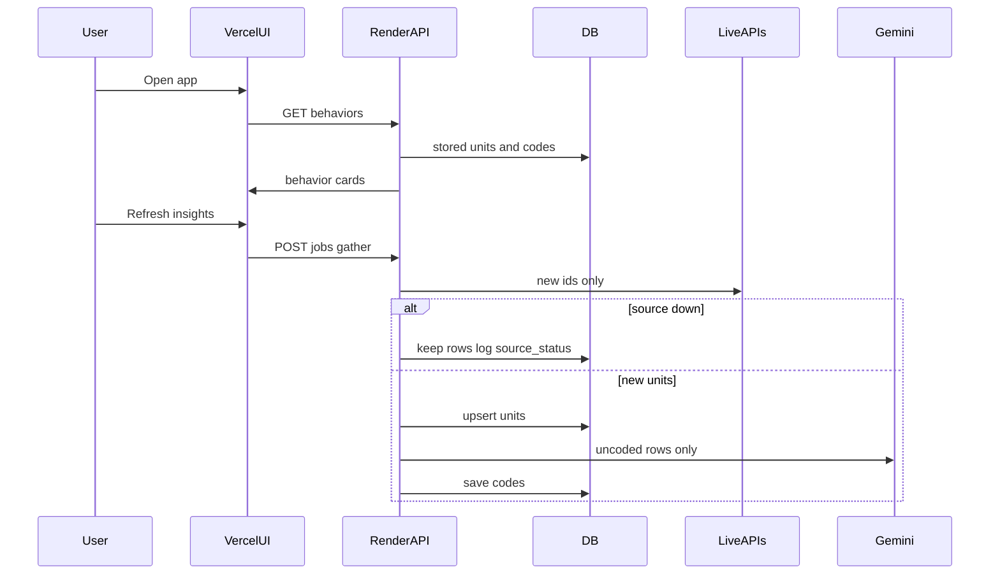

# Architecture

Store-first AI Discovery Engine. Sources: [ai_discovery_engine_4d13c1f6.plan.md](ai_discovery_engine_4d13c1f6.plan.md), [context.md](context.md).

## Principle

**Reads never depend on live Reddit, YouTube, Apple RSS, or Gemini.** Insights are computed from Neon. Writes are incremental: fetch new IDs only, code uncoded rows only, never delete stored units because a source failed.

Gemini does not search the web. Connectors find text; Gemini labels stored text.

## System view



| Layer | Role | Runs where |
|---|---|---|
| `web/` | Behavior cards, detail, explorer; no file upload | Vercel |
| `backend/` | Connectors, pipeline, `GET` insights, `POST` gather | Render |
| Neon | `units`, `codes`, watermarks, `source_status`, rollups | `DATABASE_URL` |
| Gemini | Barrier JSON on new rows only | Render outbound |
| MiniLM | Near-dup + cluster (CPU, no paid embeddings) | Render |

Secrets stay on Render. Vercel only has `NEXT_PUBLIC_API_URL` (and a server-side `INGEST_TOKEN` if gather is proxied through a Next route).

## Request paths

### Read (always)

1. User opens Vercel app.
2. UI calls `GET /behaviors` (and detail/explorer as needed).
3. FastAPI reads Neon, returns cards + corpus %.
4. If gather APIs are down, last save still returns. UI may show `YouTube stored-only`.

### Write (optional refresh)

1. Empty DB on first visit: UI may `POST /jobs/gather` (gated by `INGEST_TOKEN`).
2. Later: **Refresh insights** same job; only **new** IDs after watermarks.
3. Job: connectors → upsert `units` → relevance on new rows → Gemini if `coded_at IS NULL` → rebuild behavior map from codes (no extra LLM).
4. One source error: log `source_status`, keep going, **do not** delete old rows.



## Pipeline

1. **Normalize** — envelope: `source`, `source_id`, `url`, `author_hash`, `created_at`, `text`, `parent_context`. Upsert `units`. Dedup `(source, source_id)` and `content_hash`.
2. **Relevance** — cheap filter on **new** rows (wishlist / shortlist / fashion non-buy).
3. **Extract** — Gemini JSON: `primary_barrier`, `secondary_barriers`, `outcome_stance`, `intensity`, `w2p_stage`, quotes, supporting codes. Skip if hash/embedding matches a coded unit.
4. **Behavior map** — roll up + cluster from stored codes (CPU).
5. **Numbers** — `% didn’t buy` = share of coded relevant units with that `primary_barrier` (sums ~100%). Also N, unique voices, stance mix, source mix, intensity, overlaps.

## Data model (logical)

| Store | Purpose |
|---|---|
| `units` | Raw conversation; unique `(source, source_id)`; `content_hash`; `last_seen_at` |
| `codes` | Gemini JSON; `coded_at`; never rewrite unless schema migration |
| `source_watermarks` | Reddit after-id, YouTube page token, RSS etag/date |
| `source_status` | last OK / error per connector (UI banner) |
| `behavior_rollups` | Optional cached cards; else compute on GET from `codes` |

Author identity is hashed. No secrets in Neon besides what the app writes.

## Connectors

Shared interface; Play Store **omitted** (no free official third-party API).

| Connector | API | Notes |
|---|---|---|
| Reddit | OAuth / PRAW | Queries in `configs/default.yaml` |
| YouTube | Data API v3 | Search + commentThreads; quota cap in config |
| App Store | Public RSS | Myntra, AJIO, Nykaa Fashion, Amazon IN |

Quota-safe first run (small). Later runs cheap because of skip-already-coded.

## HTTP surface (v1)

| Method | Path | Behavior |
|---|---|---|
| GET | `/health` | Process up; not a live-API check |
| GET | `/behaviors` | Ranked cards + header mix + source_status |
| GET | `/behaviors/{id}` | Detail, quotes, overlaps |
| GET | `/units` | Explorer search/filter |
| GET | `/jobs/{id}` | Gather progress for poll |
| POST | `/jobs/gather` | Requires `INGEST_TOKEN`; background; incremental |

CORS: Vercel origin only. No multipart upload routes.

## Frontend

`web/` Next.js on Vercel. Talks only to Render.

- Home: Why they didn’t buy — % cards, donut, chips, refresh
- Detail: mechanism, quotes, levers, download
- Explorer: audit table

Accent `#E11D48`. Footer caption: corpus %, not Myntra conversion. Auto-gather only if DB empty; otherwise always paint stored data first.

## LLM and embeddings

| Runtime | Model |
|---|---|
| Render | Gemini Flash (free key) |
| Laptop | Ollama fallback if no Gemini |
| Render | MiniLM / sentence-transformers for near-dup and cluster |

Never put Gemini/Reddit/YouTube keys in Vercel client env.

## Resilience

| Failure | Behavior |
|---|---|
| Reddit/YouTube/RSS down | Partial gather; old `units` kept; banner stored-only |
| Gemini down | Skip new coding; old `codes` served |
| Render sleep | First request slow; data still in Neon |
| Reddit cloud IP block | Gather from laptop once; UI still on Vercel via Neon |
| Duplicate fetch | Upsert no-op; no Gemini call |

## Deploy

| Piece | Host | Config |
|---|---|---|
| Dashboard | Vercel | `NEXT_PUBLIC_API_URL` |
| API + jobs | Render | `uvicorn`; Reddit, YouTube, Gemini, `DATABASE_URL`, `INGEST_TOKEN`, `CORS_ORIGINS` |
| DB | Neon | Postgres |
| Schedule | Optional GitHub Action | Render free has no cron |

Local: SQLite optional via `DATABASE_URL`; Ollama allowed. Production LLM is Gemini.

## Repo layout

```
backend/          FastAPI, connectors, pipeline, taxonomy, CLI
web/               Next.js
configs/default.yaml   queries, app IDs, quota caps
eval/gold_set.jsonl
.env.example
render.yaml
Docs/              problemstatement, context, architecture, plan
```

## What this architecture refuses

Scraping, paid review APIs, Play Store connector, file upload, re-coding stored text, LLM-as-search-engine, Ollama on Render, Streamlit, API secrets in the Vercel bundle.
