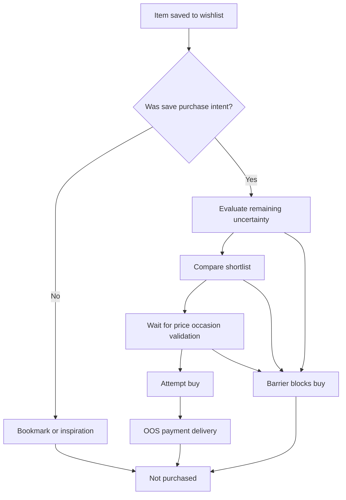
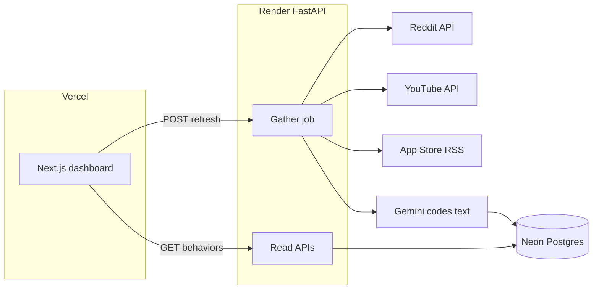
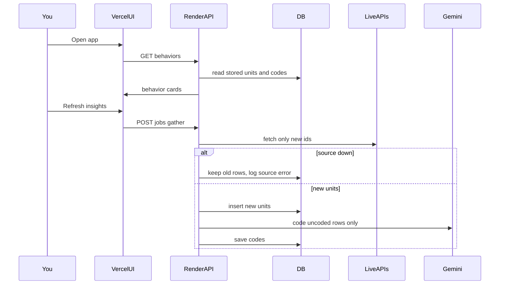

# AI Discovery Engine (Why wishlist items are not purchased)

## Primary question

**Why do users add fashion products to a wishlist and then not buy them? What distinct reasons and barriers explain that drop-off?**

v1 is not a general review summarizer. Every pipeline stage, code, score, and UI view is in service of **wishlist → not purchased**:

- Separate **bookmarking** from **failed purchase intent**
- Separate **postpone** from **abandon**
- Describe **behaviors** (what people do and why) **and** show **numbers** (share of analyzed conversations, unique voices, stance mix)
- Surface **emergent** reasons the seed list did not anticipate

Secondary questions stay in the model because they *explain* non-purchase.

This is a greenfield repo. **Store-first:** fetch → save raw text → code new rows only → insights always read from DB. APIs being down must not blank the product.

## Seed barrier taxonomy (reasons users don’t buy from wishlist)

The extractor starts from these families so results are comparable. Codes are **not** mutually exclusive (e.g. fit uncertainty + waiting for sale). LLM may add `other_*` labels; clustering promotes those into named barriers if they repeat.

**A. Wishlist was not real purchase intent**

- `bookmark_inspiration` — save looks / ideas, not a buy list
- `bookmark_compare_later` — parking lot for shortlist, decision deferred by design
- `gift_or_other_person` — saved for someone else, stalled on their preference
- `low_urgency_maybe` — “like it” without a wear plan

**B. Uncertainty after the product is already identified** (liked it, still can’t commit)

- `fit_size_uncertainty` — size chart distrust, brand sizing, body type, stretch
- `looks_vs_reality` — color, fabric, drape, length, sheerness vs studio photos
- `styling_wardrobe_fit` — don’t know how to pair / whether it matches closet
- `occasion_timing` — no event yet, wrong season, “will I actually wear this”
- `social_validation` — need real-user photos, friends, creator haul before buy

**C. Economic and value barriers**

- `wait_for_price_drop` — sale, coupon, price-watch; wishlist as alert
- `better_price_elsewhere` — AJIO / Amazon / brand site / offline
- `budget_payday` — want it, cash or credit timing
- `value_doubt` — quality vs MRP, “not worth it at this price”

**D. Risk, trust, and reversal cost**

- `return_exchange_friction` — hassle, pickup, refund delay, try-and-return culture as a crutch
- `review_trust` — fake/incentivized reviews, too few similar-body reviews
- `past_bad_experience` — previous order quality, size, seller
- `counterfeit_or_seller_doubt`

**E. Choice and comparison friction**

- `too_many_shortlisted` — analysis paralysis across similar SKUs
- `missing_compare_tools` — can’t compare fabric/fit/price/reviews in one view
- `switched_to_alternative` — bought a different product/brand instead

**F. Operational / product availability (wanted it, couldn’t complete)**

- `oos_after_wishlist` — style or size gone
- `delivery_too_slow` — occasion would be missed
- `payment_or_app_friction` — checkout, COD, app bugs
- `forgotten_wishlist` — no reminder; list went stale

**G. Off-platform information still missing**

- `seeking_external_proof` — YouTube/Reddit/Instagram/friends before converting the save

Each coded unit also gets:

- `primary_barrier` — one main reason used for **% didn’t buy** (shares sum to ~100%)
- `secondary_barriers` — extra codes for “often with”
- `outcome_stance`: `postpone` | `abandon` | `bookmark_only` | `unclear`
- `intensity` 1–5 (annoyance vs hard block)
- `w2p_stage`: `save → evaluate → compare → wait → checkout-fail`
- evidence span (quote) + confidence



## Metric and scoring (behavior + corpus numbers)

Primary business lens: **wishlist → purchase**.

**Numbers we do show** (computed only from **stored, relevant, coded** conversations — the working dataset):

- **Didn’t buy because of X:** `%` of conversations whose `primary_barrier` is X (this is the “18% didn’t buy” line)
- **N conversations / N unique voices** behind that %
- **Stance mix** for that behavior: postpone % · abandon % · bookmark %
- **Source mix:** Reddit % · YouTube % · App Store %
- **Intensity** average (1–5)
- Overall header: bookmark vs failed-intent vs postpone vs abandon on the full dataset

**Label on every %:** “of analyzed wishlist conversations” — not “of all Myntra users.” Same number the user asked for; honest denominator.

**Sort:** by primary-reason % (largest share of “didn’t buy for this” in the corpus), then intensity.

One post can have secondary reasons; only `primary_barrier` feeds the 18%-style headline so percentages do not double-count.

## Supporting codes (explain the barrier, not a second product)

Attached to the same unit so we can slice barriers:

| Code | Role |
|---|---|
| `wishlist_motive` | intent vs bookmark vs price-watch — splits “never going to convert” from “failed intent” |
| `attribute_role` | fit, size, styling, price, reviews, occasion, social proof as *what* the barrier is about |
| `off_platform_info` | what they still seek outside Myntra/AJIO before converting |
| `unmet_need` | repeated ask with no adequate PDP/UX answer |
| `segment` | inferred category, price tier, occasion, gender presentation — always labeled inferred |

Headline in the UI is **behavior cards + % didn’t buy (corpus)**.

## Architecture



**Read path never needs live APIs.** `GET /behaviors` only reads Neon. If Reddit, YouTube, Apple, or Gemini is down, the last stored insights still load. Refresh may fail or be partial; the dashboard stays up.

**Write path is incremental (save tokens):**

- Persist every fetched unit (`units`) and every Gemini JSON (`codes`) with `UNIQUE (source, source_id)` and `content_hash`
- Near-dup: skip Gemini if embedding/hash matches an already-coded unit
- Watermark per source (`last_seen_at` / Reddit after id / YouTube page token) so refresh only asks APIs for **new** items
- Gemini is called **only** for `coded_at IS NULL`
- Rebuilding the behavior map is CPU-only from stored codes — **zero extra tokens**

If one source errors, save what succeeded, record `source_status`, keep going. Never delete old units because a fetch failed.

## Free data connectors (v1)

Hard constraint: **free + official/public APIs only** — no HTML scrapers, no SerpAPI / DataForSEO / paid Play aggregators.

| Source | Cost | v1 connector | Notes |
|---|---|---|---|
| Reddit | Free (rate-limited app) | Official Reddit OAuth via PRAW | Create a free script app at reddit.com/prefs/apps. Queries: `wishlist`, `waiting for sale`, `size chart`, `should I buy`, `Myntra return`, `AJIO fit` |
| YouTube | Free (default ~10k quota/day) | YouTube Data API v3 | Free key from Google Cloud. Haul / fit / “Myntra haul” comments. Cap pages in config so a run cannot blow quota |
| App Store reviews | Free | Public Apple customer-reviews RSS | Myntra, AJIO, Nykaa Fashion, Amazon IN — no key |
| LLM coding | Free | Gemini 1.5/2.x flash (AI Studio free) **or** Ollama (e.g. llama3.1) | Auto-select: Gemini if key present, else Ollama |
| Embeddings | Free | Local `sentence-transformers` | Theme clustering without a cloud embedding bill |

**Not in v1 (would require paid or unofficial access):** Google Play reviews (no free official third-party API), Instagram, TikTok, X/Twitter, Amazon/Flipkart Q&A. `SourceConnector` stays pluggable; Play is **omitted**, not stubbed behind a paid key.

Each connector writes the same envelope, then **upserts** into `units`. Re-fetch of the same `source_id` is a no-op (maybe bump `last_seen_at`).

**Quota-safe defaults:** small first run. Later runs should be cheap because of skip-already-coded.

## How it works (AI search, not upload)

There is **no manual upload** of CSVs, screenshots, or review dumps. You also do not paste comments into the UI.

Two different “AI” steps — people often mix them up:

1. **Find conversations (API search, automatic)** — the backend calls Reddit, YouTube, and Apple RSS with a **built-in query list** (`wishlist`, `waiting for sale`, `size chart`, `should I buy`, `Myntra return`, `AJIO fit`, haul videos, app IDs). This is not ChatGPT browsing the whole internet. It is targeted, free, official APIs. Gemini does not replace these connectors.
2. **Understand them (Gemini)** — after text is stored, Gemini labels *why they didn’t buy* (fit, price wait, bookmark, OOS, …), postpone vs abandon vs bookmark, and quotes. That is the AI analysis.

**One-time setup (you):** put free keys in Render env (Reddit app, YouTube key, Gemini key). After that, data collection is hands-off except optional **Refresh insights**.

**When gather runs:**

- **First visit, empty DB:** start gather; UI shows progress. If gather fails, show error + empty — there is nothing stored yet.
- **Later visits:** UI loads **stored** behaviors immediately. Refresh is optional and only processes **new** IDs.
- **API offline:** banner “Could not reach Reddit/YouTube; showing last saved insights (date).” Gemini outage: skip coding new rows; old codes unchanged.



## Pipeline stages

1. **Normalize and store** — upsert `ConversationUnit`. Dedup `source+source_id` and `content_hash`.

2. **Relevance filter** — cheap, on new rows only.

3. **Barrier extraction** — Gemini **only if uncoded**. Persist codes. Never re-send the same text to save tokens.

4. **Behavior map from storage** — cluster/roll-up from existing codes. No LLM required to refresh the list after coding.

5. **Describe behaviors + numbers** — each card: name, mechanism, **% didn’t buy (primary)**, N, stance mix, co-occurring behaviors, quotes.

## Insights UI (Vercel)

Next.js app in [web/](web/), deployed to **Vercel**. It only talks to the Render API (`NEXT_PUBLIC_API_URL`). **No file input, no drag-and-drop reviews.**

Protect gather with `INGEST_TOKEN` (sent as a header from a server route or a simple gate) so random visitors cannot burn YouTube/Gemini quota. Dashboard read APIs can stay public or share the same light gate.

Visual language: dark-on-white research dashboard, Myntra-adjacent pink (`#E11D48`) only for the active rank bar and primary buttons — not a consumer shopping site.

### Layout (every page)

```
+------------------+--------------------------------------------+
| Why they didn't  |  Page content                              |
| buy (home)       |                                            |
| Barrier detail   |                                            |
| Evidence explorer|                                            |
|                  |                                            |
| Filters          |                                            |
| Source / brand   |                                            |
| Stance           |                                            |
| Date range       |                                            |
+------------------+--------------------------------------------+
| Footer: last saved at timestamp. Caption: "% of analyzed conversations, not Myntra conversion."
+---------------------------------------------------------------+
```

### Page 1 — Home: “Why they didn’t buy from wishlist”

This is the default after launch.

**Top row:** last refresh · sources OK vs stored-only · **847 conversations analyzed** · bookmark 22% · postpone 51% · abandon 27%

**Preset chips:** Bookmark vs intent · Fit & size · Waiting for price · Out of stock · Comparison paralysis · Off-app research · Forgotten list

**Main panel — behavior cards** sorted by **% didn’t buy** (primary reason):

- Big **18%** + “didn’t buy because…”
- N conversations / unique voices
- 1-line what they do
- Mini stance split (postpone / abandon / bookmark %)
- Source mix %
- Often with

**Also:** horizontal bar or donut of primary reasons totaling ~100%.

Empty/error: if DB has data, always show it. Auto-gather only when DB is empty. **Refresh insights** fetches **new** items only.

### Page 2 — Barrier detail

Opened from a home row.

- Title + **18% didn’t buy for this (152 / 847 conversations)** + W2P stage
- Stance mix bar: postpone 61% · abandon 24% · bookmark 15%
- **Behavior:** what they do and why
- **What we heard** — quotes
- **Often with** — related behaviors + their overlap %
- **Possible levers**
- Download quotes + CSV of the coded rows for this barrier

### Page 3 — Evidence explorer

Raw coded units for analysts:

- Search box over quotes
- Table: date, source, stance, barriers, snippet
- Click row → full text + model confidence
- Does not replace Page 1; it is the audit trail

## Sample output you will see (final)

Behavior cards **plus** detailed numbers. Headline % = share of **analyzed wishlist conversations** whose primary reason is this (not live Myntra conversion).

**Home:**

```
Last saved: 24 Aug 2026, 8:10pm    Reddit OK · YouTube stored-only
Analyzed: 847 conversations · 612 unique voices
Overall stance: bookmark 22% · postpone 51% · abandon 27%

Why they didn’t buy from wishlist
(% of analyzed conversations — primary reason; bars sum to ~100%)

Price wait 24% | Size/fit 18% | Bookmark 16% | Looks vs reality 12%
OOS 9% | Returns hassle 8% | Compare paralysis 7% | Other 6%

[ Bookmark vs intent ] [ Fit & size ] [ Waiting for price ] [ Out of stock ] ...

1.  24%  didn’t buy — waiting for a “real” discount     203 / 847 · 156 voices
    What they do: Keep it wishlisted as a price alert until sale/coupon feels honest vs MRP.
    Stance mix: postpone 78% · abandon 9% · bookmark 13%
    Sources: Reddit 61% · App Store 29% · YouTube 10%
    Intensity 3.4/5    Often with: value doubt 41%, forgotten list 22%

2.  18%  didn’t buy — like the look, don’t trust the size   152 / 847 · 119 voices
    What they do: Product is already chosen; they stall until similar-body photos or a trusted size chart.
    Stance mix: postpone 61% · abandon 24% · bookmark 15%
    Sources: Reddit 48% · YouTube 37% · App Store 15%
    Intensity 4.1/5    Often with: looks vs reality 33%, return hassle 28%

3.  16%  didn’t buy — wishlist is a lookbook, not a cart    136 / 847 · 101 voices
    What they do: Save outfits for inspiration with no wear plan.
    Stance mix: bookmark 81% · postpone 14% · abandon 5%
    Sources: Reddit 88% · YouTube 12%
    Intensity 2.1/5    Often with: low urgency 44%
```

Click card 2 → **detail:**

```
Like the look, don’t trust the size
18% didn’t buy for this   152 of 847 conversations   119 unique voices
Stage: evaluate (product already identified)
Intensity 4.1 / 5

Stance: postpone 61% · abandon 24% · bookmark 15%
Sources: Reddit 48% · YouTube 37% · App Store 15%
Brand mentioned: Myntra 71% · AJIO 19% · other 10%

Behavior
They have already chosen a style. The remaining job is “will this fit *my* body?”
Until that is answered, the save stays a save.

What we heard
• “Added to wishlist but scared to order — Myntra size chart never matches.”
• “Waiting to see a haul on my body type before I buy.”
• “Returns are a pain so I just leave it in wishlist.”

Often with: looks vs reality 33% overlap · return hassle 28% overlap
Possible levers: real-body photos, size confidence, easier reverse pickup
```

Caption under every %: *Of conversations we collected about not converting a wishlist. Not Myntra’s live conversion rate.*

If YouTube is down: same numbers from storage, banner `Showing stored insights. YouTube unreachable.`

## Repo layout

- [backend/](backend/) — FastAPI, connectors, pipeline, taxonomy, CLI
- [web/](web/) — Next.js (Vercel)
- [configs/default.yaml](configs/default.yaml) — search queries, app IDs, quota caps
- [eval/gold_set.jsonl](eval/gold_set.jsonl) — gold labels
- `.env.example` — Reddit, YouTube, Gemini, `DATABASE_URL`, `INGEST_TOKEN`, `CORS_ORIGINS`
- [render.yaml](render.yaml) — FastAPI `uvicorn` web service
- Vercel: root or `web/` with `NEXT_PUBLIC_API_URL`

## Deploy: Vercel frontend + Render API

| Piece | Where | Free approach |
|---|---|---|
| Dashboard | **Vercel** | Next.js, env `NEXT_PUBLIC_API_URL` |
| Gather + LLM + DB writes | **Render** | FastAPI, background gather job, env secrets |
| Database | **Neon** | `DATABASE_URL` on Render (and optionally Vercel if you add a thin read proxy — v1 reads go through Render only) |
| LLM | Gemini on Render | Ollama not used in cloud |
| Auto-schedule | Optional GitHub Action | Render free has no cron |

**Honest limits:** YouTube/Gemini daily quotas; Render free sleeps; gather can take several minutes; Reddit may block some cloud IPs (fallback: run gather from a laptop once, data still shows on Vercel via Neon/Render).

**Not in v1:** file upload, Play Store, scraping, Streamlit, putting API secrets in Vercel (they stay on Render).

## Bias and quality (required, not optional)

Public chatter over-represents loud, English, complaint-heavy users. Show % of **this dataset**, with caption. Do not present it as Myntra’s live conversion rate. Reddit vs app reviews stay separable. Gold-set eval on coding quality.

## v1 success criteria

- Insights **always** load from Neon; live API outage does not blank the UI
- Same `source_id` / `content_hash` is **never** sent to Gemini twice
- Refresh only fetches **new** items (watermarks)
- UI shows behavior + quotes **and** % didn’t buy / N / stance mix (corpus, labeled)
- No upload; Vercel + Render + Neon; README for env setup
- Gold-set on relevance, `outcome_stance`, `primary_barrier`

## Out of scope for v1

Internal Myntra telemetry, scraping, paid APIs, Play Store, file upload, re-coding stored text, unconstrained LLM web search, Ollama on Render. Corpus % is in scope; claiming it is official Myntra W2P is not.
